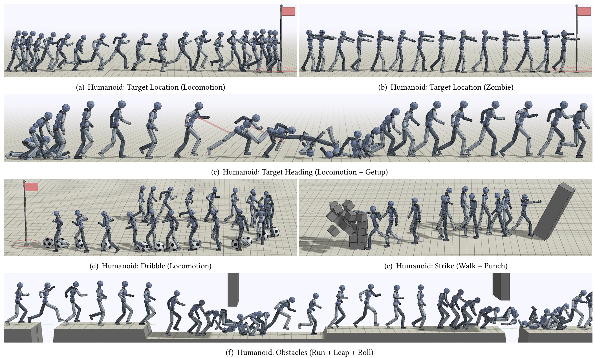
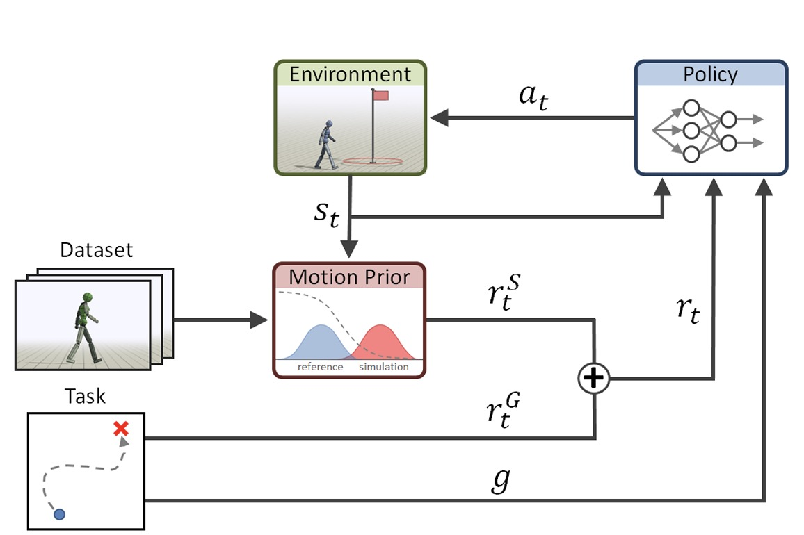

바로 두번째 논문 리뷰로 돌아왔습니다. 

이번에 리뷰할 논문은 *AMP: Adversarial Motion Priors for Stylized Physics-Based Character Control*입니다. 

지난번에 리뷰한 DeepMimic 논문 저자의 후속 논문으로, 지난번에는 하나의 demonstration clip을 잘 따라하면서 goal을 달성하는 모델 구축을 했다면, 이번에는 다양한 skill들의 motion prior들을 학습함으로 policy가 goal을 달성하는 것 뿐만 아니라 data distribution과 비슷한 동작을 만들 수 있게 합니다. 이 방법을 통해 DeepMimic과 달리 phase variable을 설정할 필요 없이, 그리고 복잡한 imitation reward를 직접 제작할 필요 없이 동작들을 task에 맞게 자연스럽게 만들 수 있습니다. 

# AMP

AMP의 기본 아이디어는 GAIL에서 옵니다. Demonstration과 policy action을 구별하는 adversarial network(이 모델이 AMP입니다)를 학습하여 policy가 출력하는 동작이 얼마나 demonstration data distribution에 가까운지 판단할 수 있습니다. 이 결과는 그대로 reward function의 일부로 사용되어 policy가 학습될때 자연스러운 동작들을 생성할 수 있게 만듭니다. 이 프레임워크가 잘 학습되기 위해 저자들이 선택한 design choice들에는 다음이 있습니다. 

- RSI
- Early Termination
- Gradient Penalty
- Discriminator Observation
- Least-Squares Discriminator

RSI와 ET는 DeepMimic에서 설명한 것과 같습니다. 

Gradient Penalty와 Least-Squares Discriminator는 GAN에서 발생하는 문제들을 방지하기 위한 기법들로, 각각 모델이 수렴이 못하고 진동하는 문제와 vanishing gradient 문제를 해결하기 위해 적용되었습니다. 실험 결과를 분석해보면 실제로 Gradient Penalty는 policy 모델 성능에 직접적인 영향을 미치는 것을 볼 수 있습니다. 

## Training

학습 과정은 다음과 같습니다. 

1. AMP, policy, value function, replay buffer 초기화
2. 현재 policy로 rollout을 하여 trajectory 수집
3. 수집된 trajectory와 AMP reward값, goal reward값을 replay buffer에 저장
4. 여러개의 trajectory에 대해 2-3을 반복
5. AMP 모델 학습: replay buffer와 demonstration data를 사용하여 모델 학습
6. policy 및 value function 학습: PPO 알고리즘을 활용하여 replay buffer에서 데이터를 샘플링하여 학습
7. 2-6을 반복

AMP는 다음과 같은 loss function을 사용합니다. 
$$
\arg \min_{D} \quad & \mathbb{E}_{d^{\mathcal{M}}(s,s')} \left[ (D(\Phi(s), \Phi(s')) - 1)^2 \right] \\
& + \mathbb{E}_{d^{\pi}(s,s')} \left[ (D(\Phi(s), \Phi(s')) + 1)^2 \right] \\
& + \frac{w^{\mathrm{gp}}}{2} \mathbb{E}_{d^{\mathcal{M}}(s,s')} \left[ \left\| \nabla_{\phi} D(\phi) \Big|_{\phi=(\Phi(s),\Phi(s'))} \right\|^2 \right]
$$

이렇게 학습된 AMP 모델은 reward의 일부로서 다음과 같이 적용됩니다. 

$$
r(s_t, a_t, s_{t+1}, g) = w^G r^G (s_t, a_t, s_{t+1}, g) + w^S r^S (s_t, s_{t+1})
$$

여기서 $r^G$는 task를 표현하는 goal reward, $r^S$는 motion의 style, 즉 AMP의 값이 됩니다. 

## Results

학습된 policy는 goal task에 맞게 자연스럽게 skill들을 사용하는 모습들을 보입니다. 실제로 strike와 같은 task에 대해서는 걷는 모션과 펀치 모션 두가지 demonstration으로 AMP를 학습했을 때 policy가 실제로 task subject까지 걸어서 접근한 이후에 자연스럽게 펀치를 하는 모션을 생성하는 것을 관찰할 수 있습니다. 이처럼 imitation이 아니라 style을 학습한다는 점에서 다양한 이점들을 보입니다. 

다만 한계점들도 존재합니다. GAN과 같이 Adversarial Network를 활용하는 만큼 mode-collapse 문제가 존재하며, imitation reward와 같이 직접적으로 특정 동작을 흉내내도록 reward가 주어지지 않기 때문에 특정 동작들에 대해서 학습에 어려움을 겪습니다. 또한 AMP의 학습 데이터가 policy의 rollout에 의존하다보니 general한 knowledge를 학습하기 어렵다는 문제점이 있습니다. 

---

저는 이번 논문을 읽으면서 diffusion나 flow matching을 이용하면 어떨까하는 생각이 많이 들었습니다. 실제로 최근에는 두가지를 적용한 논문들도 많기도 하고, 본 논문에서 제시한 한계점들이 GAN에서 비롯되는 문제점들이 많다보니 demonstration data distribution에서 style을 샘플링하는 아이디어만 가져와 FM을 적용하면 GAN의 한계점을 극복할 수 있을 것 같다는 생각이 들었습니다.