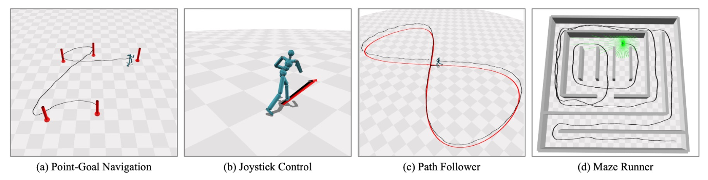
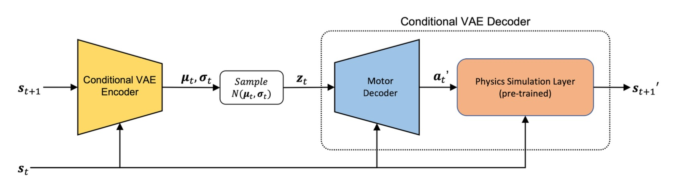
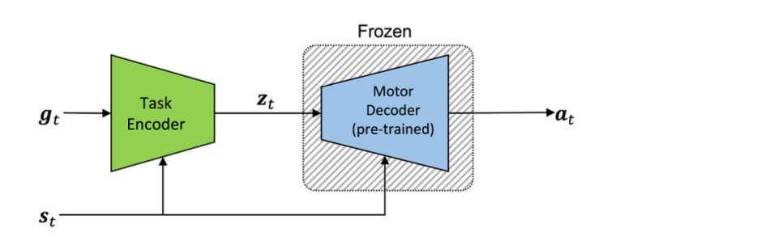
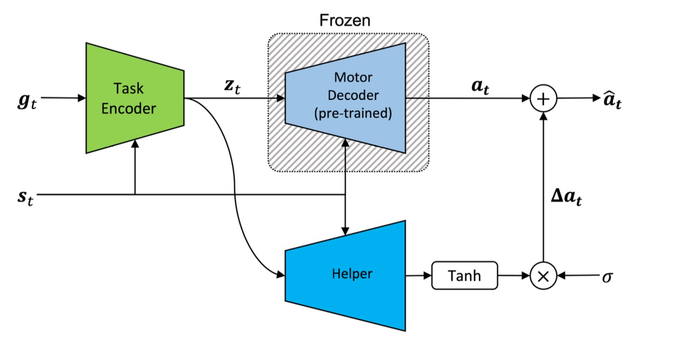

앞의 두 논문들은 reward function에 직접적으로 motion capture 데이터를 imitation 하도록 control하거나(DeepMimic), 데이터의 style을 따르도록 명시하여 pure RL로 해결했습니다. 이번 논문은 또 다른 하나의 기법인 latent space 기반으로 conditional VAE를 사용하여 생성하는 모션이 자연스러우면서도 downstream task에 빠르고 효율적으로 학습할 수 있는 방법을 제안합니다. 

# Physics-based Character Controllers Using Conditional VAEs

이 논문이 제안하는 기법은 다른 conditional VAE 기반의 생성형 모델과 크게 다르지 않습니다. Expert Trajectory를 supervised learning을 사용하여 현재 state에 condition된 VAE를 학습합니다. 이 큰 축은 유지가 되지만, physics-based, 그리고 motion generation인 만큼 디테일 적인 측면에서 다른 부분이 몇 가지가 있는데요, 제가 정리해본 결과 아래와 같이 있는 것 같습니다. 

- Expert Trajectory Extraction
- Physics Simulation Layer
- Task Encoder
- Helper Branch 

## Expert Trajectory Extraction

사실 이 부분은 논문에서 짧게 언급된 내용이지만 중요한 내용인 것 같아 따로 정리해보았습니다. Motion capture 데이터 자체에는 각 타임스탬프에 해당하는 state만이 기록되어 있기 때문에 실제로 필요한 action을 얻기 위해서는 DeepMimic과 같은 RL 기반의 policy model을 학습하여 action을 추출해야합니다.

## Physics Simulation Layer

물리 시뮬레이션 레이어는 CVAE 디코더의 한 부분으로, 앞의 motor decoder와 합쳐져 비로소 다음 state를 예측하는 디코더로서의 역할을 하게 됩니다. 이렇게 motor decoder와 physics simulation layer로 나누어져 있는 이유는 실제로 character를 control할때는 joint의 action으로 명령을 내리게 되고, 이에 따른 물리 시뮬레이션 결과로 state가 결정되기 때문입니다. 

본 논문에서 사용한 simulator는 PyBullet이기 때문에 action -> state에 대한 gradient를 계산할 수 없게 됩니다. 따라서 gradient를 계산할 수 있도록 물리 시뮬레이션 레이어를 먼저 학습시킨 후 CVAE 학습 단계에서는 freeze시켜 motor decoder만을 학습하도록 합니다. 

이렇게 VAE 디코더가 두 부분으로 나뉘는 만큼 loss equation에서도 이 부분이 명확히 보입니다. 

$$
\mathcal{L} = \sum_{N} \left[ \|\mathbf{a}_t - \mathbf{a}'_t\|^2 + \alpha \cdot \|\mathbf{s}_{t+1} - \mathbf{s}'_{t+1}\|^2 + \beta \cdot D_{KL}\big(N(\mu_t, \sigma_t) \,\|\, N(\mathbf{0}, \mathbf{I})\big) \right]
$$

보면 특이하게 앞에서 추출한 expert trajectory의 action간의 L2 loss와 물리 시뮬레이션 레이어의 출력값인 다음 state간의 L2 loss를 계산하는 것을 볼 수 있습니다. 

논문 맨 마지막에도 언급되지만, 정확한 physics simulation layer가 있다면 위 loss equation의 첫번째 항이 없어도 되어 expert trajectory extraction이 없어도 학습시킬 수 있게 됩니다. 

## Task Encoder

앞의 방법으로 학습된 CVAE의 디코더는 이제 downstream task의 low level control을 위한 컴포넌트로 활용할 수 있습니다. 

위 그림과 같이 motor decoder를 freeze 시키고, task encoder는 현재 state와 downstream task를 describe하는 goal state를 받아 motor decoder가 어떤 action을 내놓게 할지 latent space 안에서 exploration을 하게 됩니다. 이 task encoder는 RL (DD-PPO) 기반으로 학습됩니다. 

위와 같이 학습을 시키면 결국 출력되는 action 자체는 이미 학습된 motor decoder의 output space에서 결정이 되는 것이기 때문에 expert trajectory가 접하지 못한 환경에서는 성능이 급격히 하락할 가능성이 있습니다. 저자는 이 문제를 해결하기 위해 helper branch를 제안합니다. 

## Helper Branch

Helper branch는 downstream task을 수행할 때 motor decoder의 output에만 한정된 action에서 탈피해, 좀 더 task-specific한 동작을 수행할 수 있도록 도와주는 branch입니다. 

보시다시피 helper branch는 motor decoder의 action output에 직접적으로 값을 바꾸게 됩니다. 이를 통해서 기존 expert trajectory가 접하지 못했던 환경들(기울어진 바닥, crowd simulation)에서 적용해 효과적으로 task를 수행할 수 있게 됩니다. 

---

이번 논문에서는 generative model을 활용하여 physics based character controller를 학습하는 방법을 제시합니다. 이 과정에서 장단점들이 확연히 보였는데요, motor decoder를 학습하여 다양한 downstream task에 적용할 수 있다는 장점이 있는 반면에, 이 decoder가 RL을 통해 산출된 policy가 아니라 expert trajectory를 부분적으로 distillation한 결과인 만큼 stability가 비교적 떨어진다는 것입니다. 

결국 궁금해진 부분은 generative model의 강점과 RL의 강점을 어떻게 잘 융합할 수 있는지로 귀결 된 것 같습니다. AMP에서는 GAN과 유사하고, 본 논문에서는 CVAE의 구조를 채택한 것과 같이 생성형 모델을 활용하려는 노력들이 나타나는 것 같은데, diffusion model이나 flow matching을 활용한 방법들에 대해서도 관심이 부쩍 많아지게 되었습니다. 