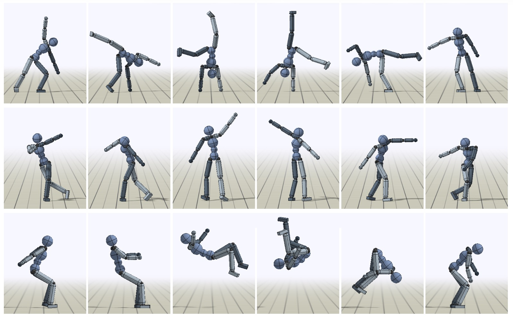
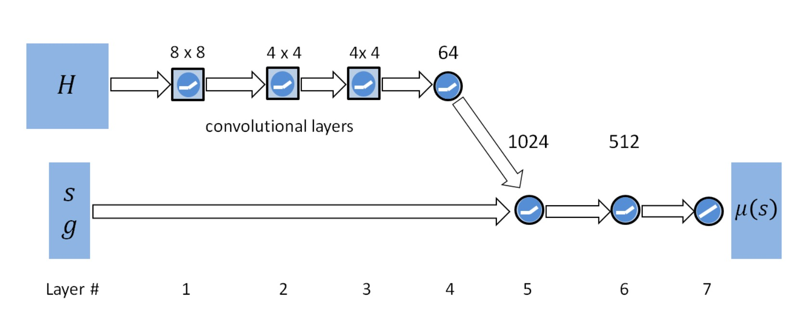

Animation, physics-based 분야의 첫 논문 리뷰입니다. 

Manipulation 쪽 논문을 읽다 이 논문을 읽으니 신선하기도 하고 생각보다 다른 approach를 사용한 부분들이 있어서 흥미로웠습니다. 간략하게 논문을 요약하고 제가 느낀점들을 이야기해보겠습니다. 

# Summary

DeepMimic은 MoCap 데이터를 사용해 Deep RL을 활용하여 imitation과 goal을 동시에 달성할 수 있는 프레임워크를 제안합니다. 기존에도 Deep RL을 활용한 애니메이션 생성 기술들이 존재하였지만, 실제 움직임과 동떨어진 모습을 보이는 한계점을 보였고, kinematics 기반의 imitation 기술들은 reference clip이 섬세하게 설계되야된다는 한계점을 갖고 있었습니다. 이 논문의 contribution은 바로 개별적으로 존재하던 data-driven method와 goal based deep RL 기법들을 융합해 실제 움직임과 동떨어지지 않는 모션을 생성할 수 있는 프레임워크를 제시했다는 것입니다. 또한 다양한 skill들을 융합하는 방법들을 제안합니다. 

# DeepMimic

먼저 DeepMimic 프레임워크를 간략히 설명하겠습니다. 

**Input**
- reference clip
- task (reward function)
- character model

위 입력들을 받으면 Neural Network로 이루어진 policy network와 value network를 PPO알고리즘을 통해 학습합니다. 이때의 reward function은 다음과 같습니다. 

$$
r_t = w^I r_t^I + w^G r_t^G
$$

Imitation reward($r_t^I$)는 reference clip의 동작을 따라하는 것을 목표로 하는 reward입니다. 각 clip은 phase variable $\phi$를 통해 clip의 시간을 나타냅니다. $\phi = 0$이면 reference clip의 시작, $\phi = 1$이면 reference clip의 끝을 의미합니다. 이 $\phi$를 state의 일부로 넣어주면서 모델이 어떤 pose를 취해야하는지 나타내줍니다. 

Goal reward($r_t^G$)는 task를 나타내는 reward입니다. 

위 reward function을 통해 모델은 PPO 알고리즘을 통해 학습이 됩니다. 학습 과정에서 저자들은 두가지 technique를 사용하여 학습을 robust하게 만들었습니다. 

## Reference State Initialization (RSI)

RSI는 reference clip의 랜덤한 timestamp에서의 state를 initial state로 initialize하는 방법입니다. 보통 initial state distribution을 fixed state로 하는 방법과 달리 RSI를 채택하면 초기에 달성하기 어려운 중간이나 후반 부분에 대한 학습을 더 빨리 진행할 수 있다는 점입니다. 특히 물리적으로 달성하기 어려운 기술같은 경우에는 RSI를 활용하지 않으면 high reward를 받는 action을 배우지 못해 실패하는 경우들이 존재합니다 (backflip 등등). 

## Early Termination (ET)

ET는 특정 link가 땅에 닿는 것과 같이, recovery가 어려운 상황에 빠르게 termination하는 방법입니다. 이후 reward를 0으로 설정하면서 해당 episode를 종료하기 때문에 reward에는 표현되지 않지만 넘어지는 행위에 대한 강한 패널티를 추가하게 됩니다. 이 방법을 통해 모델이 빠르게 학습할 수 있으며, 초기에 넘어진 이후에 원치 않는 state에 대한 data가 넘쳐나는 불균형을 해소할 수 있게 됩니다. 

---
위 테크닉들로 학습된 policy는 다음 action을 내놓고, 이는 그대로 PD 컨트롤러에 입력되어 시뮬레이션됩니다. 이렇게 하나의 skill (reference clip)에 대해 robust한 animation을 내놓는 모델을 학습할 수 있습니다. 

저자들은 다양한 skill들을 융합하는 방법에 대해서도 총 세가지의 method들을 제시합니다. 

## Multi-Clip Reward

가장 단순하게 imitation reward를 여러 clip의 imitation reward들의 max로 취하는 방법입니다. 

$$
r_t^I = \max_{j=1,...,k} r_t^j
$$

이 방법을 통해 모델은 현재 state와 가장 비슷한 clip을 흉내내도록 학습되게 됩니다. 

## Skill Selector

Multi-clip reward는 하나의 목표를 달성하기 위해 다양한 클립을 자동으로 선택하는 방식을 택했다면, skill selector는 유저가 직접 policy가 어떤 skill을 수행할지 선택할 수 있게 합니다. Policy는 어떤 skill을 수행할지 알려주는 one-hot vector를 입력받고, 해당하는 skill에 대한 imitation reward를 계산하여 반영합니다. 이 method에서는 goal reward를 제외하고 imitation reward만 받는 방식으로 학습을 진행합니다. 

## Composite Policy

앞의 두 방법들은 하나의 policy를 학습하는 방법이었던 반면, composite policy는 divide-and-conquer 전략을 취해 각 skill을 학습한 여러개의 policy들을 병합합니다. 각 skill의 value function이 현재 state에 대해 각 skill에 대한 expected return이라는 점을 활용하여 볼츠만 분포를 통해서 policy를 표현합니다. 

$$
\Pi(a|s) = \sum_{i=1}^k p^i(s) \pi^i(a|s), \; p^i(s) = \frac{e^{V^i(s)/T}}{\sum_{j=1}^k e^{V^j(s)/T}}
$$

위 policy를 통해서 추가적인 학습 없이 자연스럽게 연속적으로 다양한 skill들을 수행할 수 있습니다. 

---

이렇게 DeepMimic에 대해 알아보았습니다. 

Behavior cloning에 익숙한 저로서는 흥미로운 paper였습니다. 물론 지금 시점으로는 꽤 옛날 논문이기도 하고 공동저자로 있는 저자들이 현재 로보틱스 분야에서 유명한 교수님들인것 만큼 로보틱스에서는 이미 흔한 기법인 것 같습니다. 이런 시뮬레이션 상에서 Deep RL을 하면서 얻을 수 있는 가장 큰 이점은 바로 대량의 데이터셋이 필요하지 않다는 것인 것 같습니다. 아무리 ACT나 DP와 같이 SOTA 모델들의 성능이 좋아지긴 해도, 결국 분포 이동의 문제를 완벽하게 해결하지는 못합니다. Deep RL은 이러한 문제를 직접 exploration을 하면서 해결하며, 학습을 거듭하며 physic simulation에 대한 이해를 강화할 수 있습니다. 
